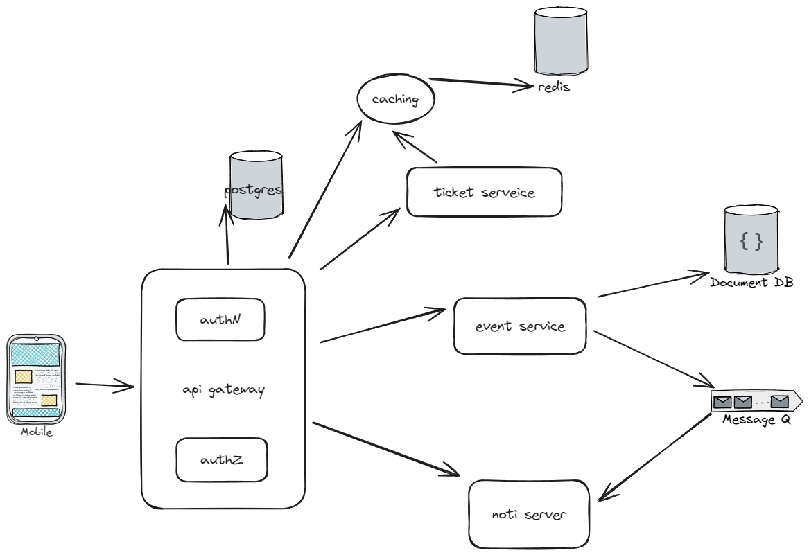

# hệ thống quản lý tổ chức sự kiện

## requirement

### Quản lý sự kiện

- người quản lý sự kiện có thể tạo, sửa, xóa(soft delete) sự kiện
- người dùng có thể tìm kiếm và đăng ký tham gia sự kiện
- quản lý thông tin sự kiện: thời gian, địa điểm, mô tả, danh sách khách mời

### Auth and account

- authN, authZ (người tổ chức, người tham gia)
- quản  lý thông tin cá nhân người dùng

### notification

- gừi email cho người dùng

### quản lý vé

- tạo QR vé
- kiểm tra vé

## Thiết kế hệ thống

- _NOTE_: dùng bun.sh cho dự án

### API Gateway

- gateway cho các service
- quản lý auth, routing, bảo mật

### user service

- đăng ký và dăng nhập
- phân quyền cho người dùng
  - người tham gia
  - người tổ chức
- quản lý thông tin người dùng

- _***Tech stack***_

  - elisya.js
  - postgres
  - jwt

### event service

- tạo, chỉnh sửa, xóa sự kiện
- quản lý thông tin sự kiện

- _***Tech stack***_

  - elisya.js
  - mongodb
  - kafka

### ticketin service

- phát hành QR vé
- xác nhận vé

- _***Tech stack***_

  - elisya.js
  - postgres
  - kafka

### noti service

- noti khi sự kiện sắp diễn ra
- noti khi sự kiện có thay đổi

- _***Tech stack***_

  - elisya.js
  - kafka

### report service

- thống kê ....

- _***Tech stack***_

  - python + data tools

