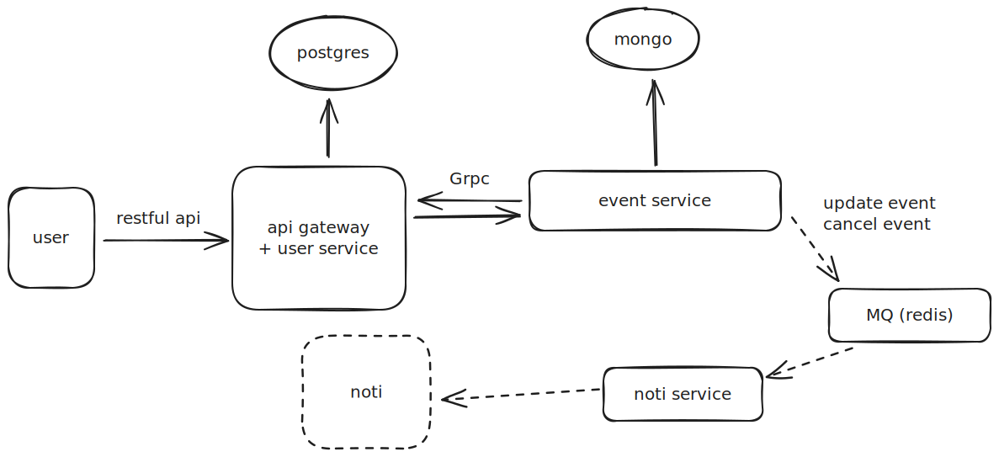

# hệ thống quản lý tổ chức sự kiện

## requirement

### Quản lý sự kiện

- người quản lý sự kiện có thể tạo, sửa, xóa(soft delete) sự kiện
- người dùng có thể tìm kiếm và đăng ký tham gia sự kiện
- quản lý thông tin sự kiện: thời gian, địa điểm, mô tả, danh sách khách mời

### Auth and account

### notification

- warn: ghi thông báo vào file fake_noti.txt
- todo: gừi mail, hoặc dùng firebase thông báo

## Thiết kế hệ thống

- _NOTE_: dùng bun.sh cho dự án

