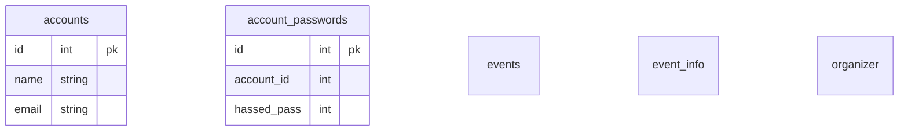

# data model

```mermaid

erDiagram
  accounts {
    id int  pk
    name string
    email string
    
  }

  account_passwords {
    id int pk
    account_id int
    hassed_pass int
  }

  events {}
  event_info {}

  organizer {}
```
