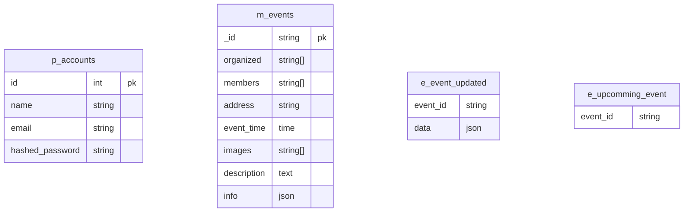

# data model

```mermaid
---
note: events use mongo db
---
erDiagram
  p_accounts{
    id int  pk
    name string
    email string
    hashed_password string    
  }

  m_events {
    _id string pk
    organized string[]
    members string[] 
    address string
    event_time time
    images string[]
    description text
    info json
  }
  
  e_event_updated {
    event_id string
    data json
  }
  
  e_upcomming_event {
    event_id string
  }
```

- prefix
  - p: postgres
  - m: mongodb
  - e: events (message kafka)
